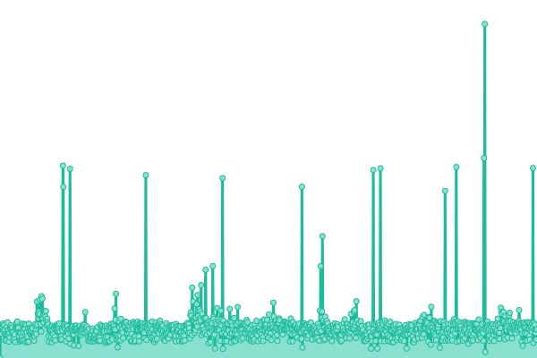

# [📈 实时状态](https://https://on.ited.top): 实时状态 **所有系统都可以正常运行**

This repository contains the open-source uptime monitor and status page for [minc_nice_100](https://ited.ml), powered by [Upptime](https://github.com/upptime/upptime).

With [Upptime](https://upptime.js.org), you can get your own unlimited and free uptime monitor and status page, powered entirely by a GitHub repository. We use [Issues](https://github.com/minc-nice-100/on/issues) as incident reports, [Actions](https://github.com/minc-nice-100/on/actions) as uptime monitors, and [Pages](https://https://on.ited.top) for the status page.

## [📈 Live Status](https://demo.upptime.js.org): <!--live status--> **所有系统都可以正常运行**

<!--start: status pages-->
<!-- This summary is generated by Upptime (https://github.com/upptime/upptime) -->
<!-- Do not edit this manually, your changes will be overwritten -->
<!-- prettier-ignore -->
| 链接 | 状态 | 历史状态 | 响应时间 | 正常运行时间 |
| --- | ------ | ------- | ------------- | ------ |
|  [ited博客](https://ited.top/) | 🟩 正常运行 | [ited.yml](https://github.com/minc-nice-100/on/commits/HEAD/history/ited.yml) | 

 11228ms
     
 | 

<a href="https://https://on.ited.top/history/ited">100.00%</a>
    

|  [心理分站 - ited博客](https://yy.ited.top/) | 🟩 正常运行 | [ited.yml](https://github.com/minc-nice-100/on/commits/HEAD/history/ited.yml) | 

 11228ms
     
 | 

<a href="https://https://on.ited.top/history/ited">100.00%</a>
    

|  [lib - ited博客](https://lib.ited.top/) | 🟩 正常运行 | [lib-ited.yml](https://github.com/minc-nice-100/on/commits/HEAD/history/lib-ited.yml) | 

 413ms
     
 | 

<a href="https://https://on.ited.top/history/lib-ited">100.00%</a>
    

|  [ited网盘](https://pan.ited.top/) | 🟩 正常运行 | [ited.yml](https://github.com/minc-nice-100/on/commits/HEAD/history/ited.yml) | 

 11228ms
     
 | 

<a href="https://https://on.ited.top/history/ited">100.00%</a>
    

|  [github加速 - ited博客](https://github.ited.top/) | 🟩 正常运行 | [github-ited.yml](https://github.com/minc-nice-100/on/commits/HEAD/history/github-ited.yml) | 

 269ms
     
 | 

<a href="https://https://on.ited.top/history/github-ited">100.00%</a>
    

|  [状态 - ited博客](https://on.ited.top/) | 🟩 正常运行 | [ited.yml](https://github.com/minc-nice-100/on/commits/HEAD/history/ited.yml) | 

 11228ms
     
 | 

<a href="https://https://on.ited.top/history/ited">100.00%</a>
    

|  [ited邮箱（ited高层用）](https://mail.ited.top/) | 🟩 正常运行 | [ited-ited.yml](https://github.com/minc-nice-100/on/commits/HEAD/history/ited-ited.yml) | 

 719ms
     
 | 

<a href="https://https://on.ited.top/history/ited-ited">100.00%</a>
    

<!--end: status pages-->

[**Visit our status website →**](https://https://on.ited.top)

## 📄 License

- Powered by: [Upptime](https://github.com/upptime/upptime)
- Code: [MIT](./LICENSE) © [minc_nice_100](https://ited.ml)
- Data in the `./history` directory: [Open Database License](https://opendatacommons.org/licenses/odbl/1-0/)
